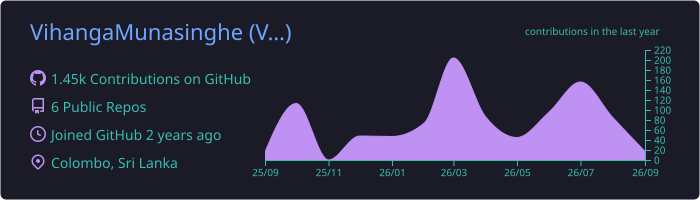
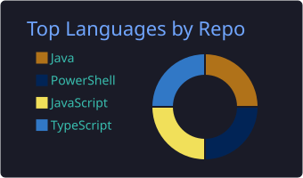
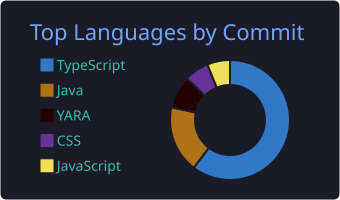
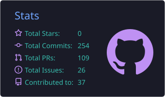
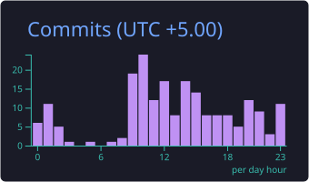
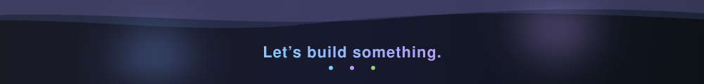

<!-- ===== HEADER ===== -->
<p align="center">
  
</p>

<p align="center">
  <a href="https://github.com/VihangaMunasinghe">
    
  </a>
</p>

<p align="center">
  <a href="https://linkedin.com/in/vihangamunasinghe"></a>
  <a href="mailto:vihangamunasinghe.official@gmail.com"></a>
  <a href="https://github.com/VihangaMunasinghe?tab=followers"></a>
</p>

<br>

<!-- ===== ABOUT ===== -->
### 👨‍💻 &nbsp;About Me

```yaml
name: Vihanga Munasinghe
role: CSE Undergraduate @ University of Moratuwa
focus: Data Science & Engineering
building:
  - agentic & multi-agent AI systems
  - edge-cloud orchestration
  - computer vision pipelines
  - full-stack web & mobile apps
previously: SE Intern @ WSO2 (identity, push auth, mobile SDKs)
open_to: research collabs & AI engineering roles
motto: "Ship things that solve real problems."
```

---

<!-- ===== STACK ===== -->
### 🧰 &nbsp;Tech Stack

<p align="center">
  <br>
  <br>
  
</p>

---

<!-- ===== STATS (generated into this repo by the Action — no third-party downtime) ===== -->
### 📊 &nbsp;GitHub Stats

<p align="center">
  
</p>

<p align="center">
  
  
</p>

<p align="center">
  
  
</p>

<p align="center">
  
</p>

---

<!-- ===== HIGHLIGHTS ===== -->
### 🏆 &nbsp;Highlights

<table align="center">
  <tr>
    <td align="center">🥈</td>
    <td><b>1st Runners-Up</b> — Tech Triathlon 2024 by Rootcode <sub>(100+ teams)</sub></td>
  </tr>
  <tr>
    <td align="center">🚀</td>
    <td><b>Best Use of Tech · Best Use of Science · Best Mission Concept</b> — NASA Space Apps Challenge</td>
  </tr>
  <tr>
    <td align="center">🎯</td>
    <td><b>Semi-Finalist</b> — Idealize 2024 <sub>(250+ teams)</sub></td>
  </tr>
</table>

---

<!-- ===== CONTRIBUTION SNAKE ===== -->
<picture>
  <source media="(prefers-color-scheme: dark)" srcset="https://raw.githubusercontent.com/VihangaMunasinghe/VihangaMunasinghe/output/github-snake-dark.svg"/>
  <source media="(prefers-color-scheme: light)" srcset="https://raw.githubusercontent.com/VihangaMunasinghe/VihangaMunasinghe/output/github-snake.svg"/>
  
</picture>

<!-- ===== FOOTER ===== -->
<p align="center">
  
</p>
